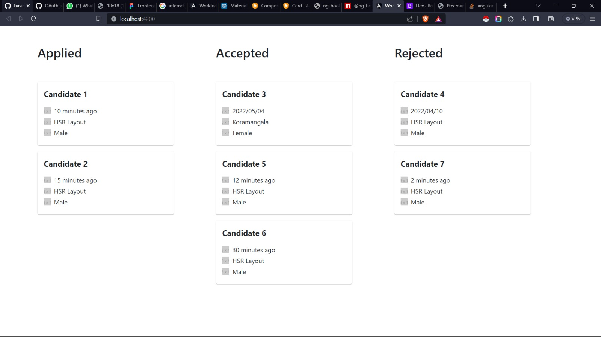

<h1 align="center">🌐 SDE Frontend Round Project - Angular</h1>
<h2>🎈 Introduction</h2>
Welcome to our cutting-edge Angular project! Crafted meticulously for the SDE Frontend Round, this application seamlessly merges high-quality code with an impeccable user interface. Explore more below!

<h2>📌 Table of Contents</h2>
Design
Features
Tech Stack
Installation
Screenshots
Judgment Criteria
Support & Queries
<h2 id="🎭-design">🎭 Design</h2>
Inspired by modern aesthetics, our application's design was envisioned to ensure fluidity, responsiveness, and user-friendliness. Feel free to compare our live version against the original design mock-ups.

<h2 id="🚀-features">🚀 Features</h2>
🎖️ Premium Look: Tailored exclusively for desktop views.
💡 Real-time Data: Leverage the power of the Mocky API.
🔱 Icon Integration: Icons via placeholder.com.
🖼️ Dynamic Flow: Functionalities brought to life from the reference screenshots.
<h2 id="🧰-tech-stack">🧰 Tech Stack</h2>
Frontend: 🅰️ Angular
APIs: 🔄 Mocky
Icons: 🖌️ placeholder.com
<h2 id="🛠️-installation">🛠️ Installation</h2>
bash
Copy code
# Clone the repository
git clone [repository-link]

# Navigate into the project directory
cd [project-directory]

# Install the required dependencies
npm install

# Start the development server
ng serve
Now, just visit http://localhost:4200/ and experience the magic.

  
Click to view!

Homepage
Details Page
... [More screenshots as needed]

<h2 id="🥇-judgment-criteria">🥇 Judgment Criteria</h2>
🖋️ Code Quality: Elegance in every line.
🎨 UI & UX: Crafted with user-centric precision.
<h2 id="🤝-support">🤝 Support & Queries</h2>
Encountered a crossroad? Connect with us via the Meet link or simply raise an issue right here. We're all ears!

